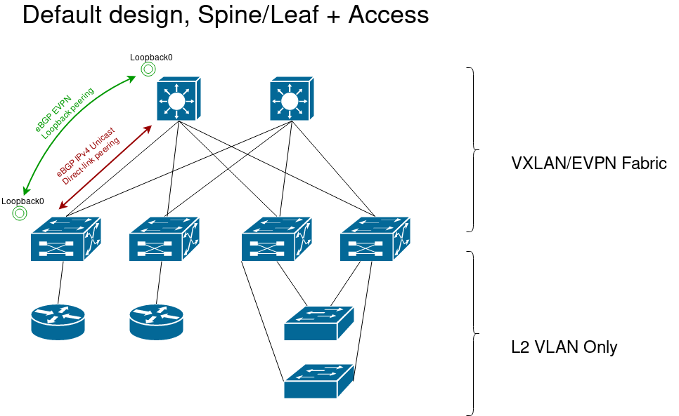

Beginner tutorial for CNaaS-NMS
===============================

CNaaS-NMS is a hybrid infrastructure-as-code (IaC) and API driven automation system.
The IaC part is managed by textfiles (YAML, Jinja2) in a version controlled repository (Git),
and the API part is managed using a JSON REST-like API. In this beginner tutorial we will learn
how to manage both parts.

Repositories
------------

There are three main repositories used by each CNaaS-NMS installation:

- templates
- settings
- etc

These repositories store configuration used to manage the nework. Changes to the network
is mostly done by updating configuration files in any of these repositories.

REST API
--------

The API runs on the container called cnaas/api and is accessible via HTTPS on port 443.
The API is used to get information on running jobs and device status, as well as allowing
minor changes to the edge of the network that should be able to be performed by an IT-helpdesk
for example, like changing port VLANs on access switches.

Runtime environment
-------------------

The components of CNaaS-NMS are executed in separate Docker containers. A docker-compose
file is used to set up the entire collection of containers in one step.

Network setup
-------------

Each container exposes one or several listening ports to the outside, some ports are only
used between different containers (like the databases) and some ports needs to be accessible
from the world outside the docker host.

External listening ports:

- API exposes port tcp/443 for HTTPS interface to the API
- DHCPd exposes port udp/69 for DHCP requests during ZTP of managed switches
- HTTP exposes port tcp/80 for ZTP config and firmware downloads from managed switches

The API container also needs access to the managed network devices using the prefered
mangement interface for each platform, like SSH or Netconf.

Management network
------------------

CNaaS expects to use a separate VLAN for ZTP boot (probably untagged/VLAN1) and additional
tagged management VLANs for use when the switch has booted up with the CNaaS managed configuration.
DHCP requests on the ZTP VLAN must be forwarded to the docker host using DHCP relay (ip helper).
For the management VLANs static IP-addresses are automatically assigned by CNaaS. For access
switches one management VLAN is created for each pair of distribution switches (called one
management domain). Distribution and core switches are managed via loopback interfaces.

VXLAN/EVPN Fabric
-----------------

CNaaS is currently focused on building a campus network using a VXLAN/EVPN overlay, but it
might work in other general cases as well. This section will discuss the network architecture
of the proposed VXLAN/EVPN fabric layer consisting of core and distribution layer switches.
In our case a core switch is the same as a spine switch would be when talking about a normal
datacenter architecture, and a distribution switch in our design is basically the same as a
leaf switch except that we will put a layer of access switches that does not participate in
the VXLAN/EVPN fabric under the leaf layer.

The top layer consists of the core (or spine) switches, each of the core switches will connect
to all of the distribution switches forming a full mesh between core and distribution. Core switches
does not have any other connections, no connections between two core switches and no external connections.

The distribution switches (leaf switches) will have the VXLAN VTEPs (Virtual Tunnel Endpoint). This
is where traffic gets encapsulated into VXLAN packets to be sent over the fabric. The distribution
switches is also where routing between different end user IP networks will happen.

All links between core and distrubiton switches are routed links with /31 linknets.

The access switches does not participate in the VXLAN fabric and instead use only 802.1Q VLAN
tagging to separate different traffic. The access switches are connected to the distribution
layer using LACP link aggregation to connect to two different distribution switches, and the
distribution layer swiches will use EVPN ESI to connect a pair of distribution switches and make
them act as a single device when talking to the access switch.
